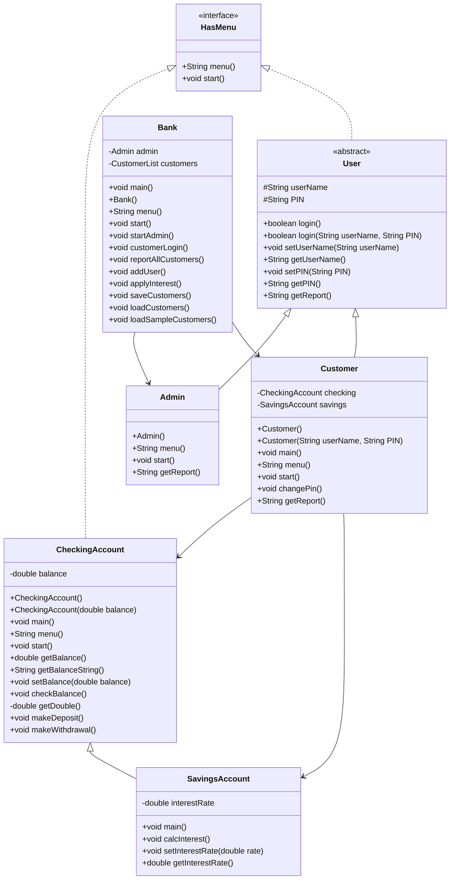

# Bank on It Part 2

**Name:** Steven Houser  
**Course:** CS 121 - Data Structures & Objects  
**Date:** 03/27/26

---

## UML Diagram

---

## Program Description

The completed banking system. Builds on Part 1 by adding an Admin class and a Bank class that ties everything together. The Bank manages a list of customers, handles admin and customer logins, and saves and loads all customer data using object serialization so data persists between runs.

---

## Algorithm

**Goal:** Integrate all classes into a working bank application with persistent storage, admin management, and customer logins.

---

### HasMenu interface

**Goal:** Define a contract that any class with a menu must fulfill.

`menu()`
- Declare method signature: returns String, no parameters

`start()`
- Declare method signature: returns void, no parameters

---

### CheckingAccount class

**Goal:** Manage a single balance with deposit, withdrawal, and balance check operations through a menu loop.

**Variables needed:**

- `balance` - the account balance (double)

`CheckingAccount()`
- Set balance to 0D

`CheckingAccount(double balance)`
- Set this.balance to the given balance

`main()`
- Create a new CheckingAccount
- Call start()

`menu()`
- Create a local Scanner
- Print blank line, "Account menu", blank line
- Print 0) Quit, 1) Check balance, 2) Make a deposit, 3) Make a withdrawal
- Print blank line and prompt "Please enter 0-3: "
- Read response with nextLine()
- Return response

`start()`
- Set keepGoing to true
- While keepGoing is true:
    - Call menu(), store result in response
    - If response equals "0": set keepGoing to false
    - Else if "1": call checkBalance()
    - Else if "2": call makeDeposit()
    - Else if "3": call makeWithdrawal()
    - Else: print invalid input message

`getBalance()`
- Return this.balance

`getBalanceString()`
- Return String.format("$%.2f", this.balance)

`setBalance(double balance)`
- Set this.balance to balance

`checkBalance()`
- Print "Checking balance..."
- Print "Current balance: " + getBalanceString()

`getDouble()` (private)
- Create a local Scanner
- Read next line as String
- Try to parse with Double.parseDouble()
- If NumberFormatException: print warning, return 0D
- Otherwise return the parsed amount

`makeDeposit()`
- Print "Making a deposit..."
- Prompt "How much to deposit? "
- Call getDouble(), store as amount
- Add amount to balance
- Print "New balance: " + getBalanceString()

`makeWithdrawal()`
- Print "Making a withdrawal..."
- Prompt "How much to withdraw? "
- Call getDouble(), store as amount
- If amount <= 0: print "Amount must be greater than zero."
- Else if amount > balance: print "Insufficient funds."
- Else: subtract amount from balance, print "New balance: " + getBalanceString()

---

### SavingsAccount class

**Goal:** Extend CheckingAccount with an interest rate that can be applied to the balance.

**Variables needed:**

- `interestRate` - the interest rate, default 0.05 (double)

`main()`
- Create a new SavingsAccount
- Call start()

`setInterestRate(double interestRate)`
- Set this.interestRate to interestRate

`getInterestRate()`
- Return this.interestRate

`calcInterest()`
- Calculate interestAmount = balance * interestRate
- Add interestAmount to balance
- Print "Interest applied. New balance: " + getBalanceString()

---

### User abstract class

**Goal:** Provide shared login logic and credential storage for all user types.

**Variables needed:**

- `userName` - the account username (String)
- `PIN` - the account PIN, stored as String (String)

`getUserName()`
- Return this.userName

`setUserName(String userName)`
- Set this.userName to userName

`getPIN()`
- Return this.PIN

`setPIN(String PIN)`
- If PIN matches regex "^\d{4}$": set this.PIN to PIN
- Else: print invalid PIN warning, set this.PIN to "0000"

`login(String userNameIn, String pinIn)`
- If userNameIn does not equal this.userName: print "Incorrect username.", return false
- Else if pinIn does not equal this.PIN: print "Incorrect PIN.", return false
- Else: print "Login Successful", return true

`login()`
- Create a local Scanner
- Prompt "User name: ", read userNameIn with nextLine()
- Prompt "PIN: ", read pinIn with nextLine()
- Call and return login(userNameIn, pinIn)

`getReport()`
- Declared abstract - subclasses must implement

---

### Customer class

**Goal:** Extend User with checking and savings accounts, and provide a customer-facing menu to manage both.

**Variables needed:**

- `checking` - the customer's checking account (CheckingAccount)
- `savings` - the customer's savings account (SavingsAccount)
- `serialVersionUID` - serialization version identifier (long)

`main()`
- Create Customer c = new Customer()
- Call c.login(), store result in loggedIn
- If loggedIn is true: call c.start()

`Customer()`
- Set userName to "Alice"
- Set PIN to "0000"

`Customer(String userName, String PIN)`
- Set this.userName to userName
- Set this.PIN to PIN

`menu()`
- Create a local Scanner
- Print blank line, "Customer Menu", blank line
- Print 0) Exit, 1) Manage Checking Account, 2) Manage Savings Account, 3) Change PIN
- Print blank line and prompt "Action (0-3): "
- Read response with nextLine()
- Return response

`start()`
- Set keepGoing to true
- While keepGoing is true:
    - Call menu(), store result in response
    - If response equals "0": set keepGoing to false
    - Else if "1": print "Checking Account", call this.checking.start()
    - Else if "2": print "Savings Account", call this.savings.start()
    - Else if "3": call changePin()
    - Else: print invalid input message

`changePin()`
- Create a local Scanner
- Prompt "Enter new PIN: "
- Read new PIN with nextLine()
- Call setPIN() with the new PIN

`getReport()`
- Build and return a formatted string with userName, checking balance, and savings balance

---

### Admin class

**Goal:** Represent the bank administrator. Extends User and provides a menu for admin tasks, but leaves the actual work to the Bank class since Bank owns the customer list.

**Variables needed:**

- (inherits userName and PIN from User)

`Admin()`
- Set userName to "admin"
- Set PIN to "0000"

`menu()`
- Create a local Scanner
- Print blank line, "Admin Menu", blank line
- Print 0) Exit, 1) Full customer report, 2) Add user, 3) Apply interest
- Print blank line and prompt "Action (0-3): "
- Read response with nextLine()
- Return response

`start()`
- Left intentionally blank - Bank handles all admin actions through startAdmin()

`getReport()`
- Return a string with "Admin: " + userName

---

### Bank class

**Goal:** The main controller. Ties together the Admin and all Customers, handles both login paths, and saves/loads the customer list so data persists between runs.

**Variables needed:**

- `admin` - the single administrator (Admin)
- `customers` - the list of all customers (CustomerList)

`main()`
- Create new Bank()

`Bank()`
- Create admin = new Admin()
- Create customers = new CustomerList()
- Call loadCustomers()
- Call start()
- Call saveCustomers()

`menu()`
- Create a local Scanner
- Print blank line, "Bank Menu", blank line
- Print 0) Exit system, 1) Login as admin, 2) Login as customer
- Print blank line and prompt "Action (0-2): "
- Read response with nextLine()
- Return response

`start()`
- Set keepGoing to true
- While keepGoing is true:
    - Call menu(), store result in response
    - If response equals "0": set keepGoing to false
    - Else if "1": call admin.login(), if true call startAdmin()
    - Else if "2": call customerLogin()
    - Else: print invalid input message

`startAdmin()`
- Set keepGoing to true
- While keepGoing is true:
    - Call admin.menu(), store result in response
    - If response equals "0": set keepGoing to false
    - Else if "1": call reportAllCustomers()
    - Else if "2": call addUser()
    - Else if "3": call applyInterest()
    - Else: print invalid input message

`reportAllCustomers()`
- For each customer in customers: print customer.getReport()

`addUser()`
- Create a local Scanner
- Prompt "New username: ", read name with nextLine()
- Prompt "New PIN: ", read pin with nextLine()
- Create new Customer(name, pin) and add to customers
- Print "User added."

`applyInterest()`
- For each customer in customers: call customer.savings.calcInterest()

`customerLogin()`
- Create a local Scanner
- Prompt "User name: ", read u with nextLine()
- Prompt "PIN: ", read p with nextLine()
- Set currentCustomer to null
- For each customer in customers:
    - If customer.login(u, p) returns true: set currentCustomer to that customer
- If currentCustomer is not null: call currentCustomer.start()
- Else: print "Login failed."

`saveCustomers()`
- Try: open FileOutputStream to "customers.dat", wrap in ObjectOutputStream
- Write customers with writeObject(), close both streams
- Catch Exception: print error message

`loadCustomers()`
- Try: open FileInputStream from "customers.dat", wrap in ObjectInputStream
- Cast readObject() to CustomerList, assign to customers, close both streams
- Catch Exception: print error message

`loadSampleCustomers()`
- Clear customers list
- Add new Customer("Alice", "1111")
- Add new Customer("Bob", "2222")
- Add new Customer("Cindy", "3333")

---

## Blackbelt Extension

The Part 1 security features carry through into Part 2 automatically:

1. **PIN validation on addUser()** - When addUser() creates a new Customer and passes the PIN, setPIN() runs the regex check ("^\d{4}$"). Any PIN that is not exactly 4 digits resets to "0000" and prints a warning. No extra code needed in Bank - it is inherited behavior from User.

2. **Negative withdrawal fix** - makeWithdrawal() still rejects amounts <= 0. This applies to any customer session started through Bank.

---

## Build Instructions

- **Build and run full app:** `make testBank`
- **Build and test Customer:** `make testCustomer`
- **Build and test CheckingAccount:** `make testChecking`
- **Build and test SavingsAccount:** `make testSavings`
- **Clean:** `make clean`
